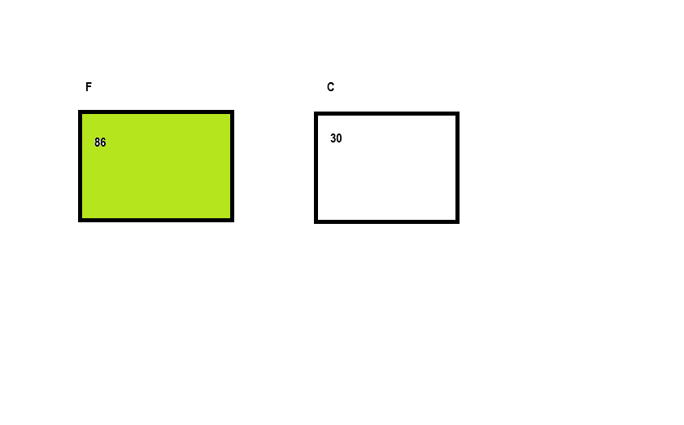

# FahrenheitEmTesteDeMesa

**Fahrenheit em Teste de Mesa**

## Enunciado

**Ler uma temperatura em graus Celsius e apresentá-la convertida em graus Fahrenheit. A fórmula de conversão é F = (((9 \* C) + 160) / 5), sendo F a temperatura em Fahrenheit e C a temperatura em Celsius.**

   

Autor: Erick Leite Freire 
Criado em: 29-12-2023 
Site: [Escola do Autodidata](https://www.escoladoautodidata.com.br) 
